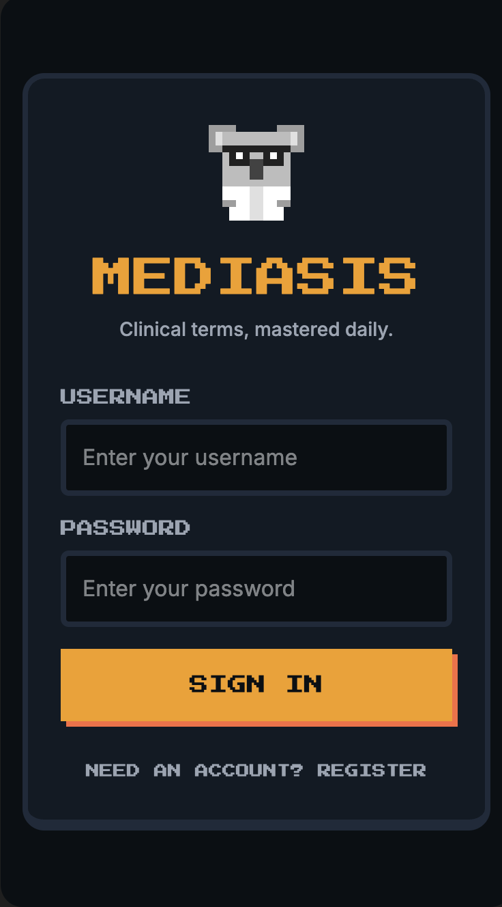
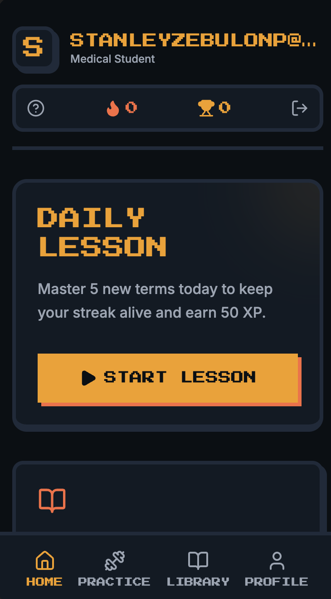
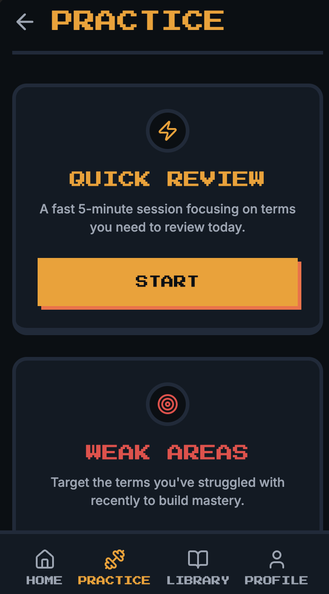
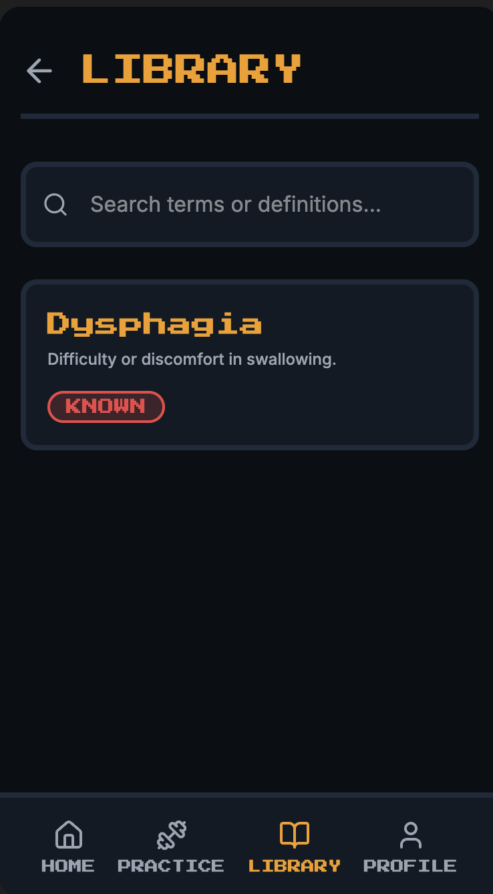
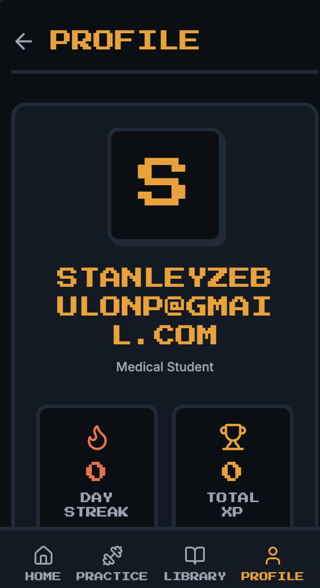
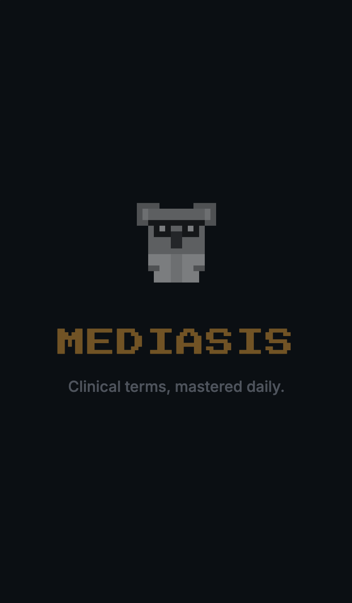

<div align="center">
  

# Mediasis

### Master clinical vocabulary, one streak at a time.

[](https://github.com/iampenuel/mediasis/actions/workflows/ci.yml)
[](https://github.com/iampenuel/mediasis/actions/workflows/native-ios.yml)
[](LICENSE)

</div>

Mediasis is a mobile-first medical terminology trainer inspired by game-like daily progress loops.
It helps learners build lasting clinical vocabulary through adaptive review, weak-area targeting, and short sessions designed for real study behavior.

## Why Mediasis Exists
Learning clinical terms is high-volume and high-friction.
Traditional memorization tools do not adapt well to what you miss, when you miss it, and how quickly you need to recover before exams or rounds.

Mediasis is built to solve that by combining:
- Fast daily lessons with immediate feedback.
- Spaced repetition logic that brings missed terms back sooner.
- Weak-area practice that focuses your limited study time.
- A mobile-first UX tuned for students and early-career clinicians.

## Who This Is For
- Medical students
- PA students
- Young clinical professionals
- Recruiters and teams evaluating product-minded AI/software engineering work

## Core Product Capabilities
- Daily lesson queue with XP progression
- Quick review and weak-area drill modes
- Category-focused practice sessions
- Searchable personal term library
- Offline-tolerant state with sync-ready architecture

## Preview


Full demo video: [Watch the complete Mediasis flow](docs/media/demo/mediasis-demo.mov)

## Screenshot Gallery
| Login | Home | Practice |
| --- | --- | --- |
|  |  |  |

| Library | Profile | Splash |
| --- | --- | --- |
|  |  |  |

## Tech Stack
- **Framework:** Expo + React Native + Expo Router
- **Language:** TypeScript
- **State/Data:** React Query, local state stores
- **Persistence:** Expo SQLite + Supabase-backed sync path
- **Auth/Storage:** Expo Secure Store
- **Mobile focus:** iOS-first UX with Android support path

## Quick Start
### Prerequisites
- Node `20.20.0`
- npm
- Xcode + iOS Simulator (for iOS local preview)

### 1) Install dependencies
```bash
npm ci
```

### 2) Configure environment
Copy `.env.example` to `.env` and set values:

```env
SUPABASE_URL=
SUPABASE_ANON_KEY=
SYNC_ENDPOINT=
EXPO_PUBLIC_SYNC_DIRECT_FALLBACK=false
```

### 3) Run iOS dev preview (prioritized path)
```bash
npm run ios:preview
```

### 4) Other run modes
```bash
npm run start
npm run android
npm run web
```

## Quality Checks
```bash
npm run typecheck
npm run lint
npm run test
npm run build:web
npm run ci:check
```

## Supabase Setup
See [supabase/README.md](supabase/README.md) for schema and sync endpoint setup.

## Collaboration and Contribution
- Contribution guide: [CONTRIBUTING.md](CONTRIBUTING.md)
- Security policy: [SECURITY.md](SECURITY.md)
- Pull request template: [.github/pull_request_template.md](.github/pull_request_template.md)
- Issue templates: [.github/ISSUE_TEMPLATE](.github/ISSUE_TEMPLATE)
- Branch protection setup: [docs/branch-protection.md](docs/branch-protection.md)
- Release process: [docs/release-process.md](docs/release-process.md)

## Project Highlights (Recruiter-Friendly)
- Productized learning workflow with adaptive repetition logic
- End-to-end mobile UX and content loop design
- Local-first architecture with optional cloud sync path
- CI quality gates for type, lint, tests, and build checks
- Public-repo engineering hygiene: templates, changelog, release model

## Roadmap
- Android UX parity pass and device matrix validation
- Better analytics on retention and weak-area recovery
- Audio pronunciation quality and speech interaction improvements
- More category packs and exam-aligned term tracks

## Disclaimer
Mediasis is an educational support tool and portfolio project.
It is **not** a clinical diagnostic or treatment system and should not be used for medical decision-making.
