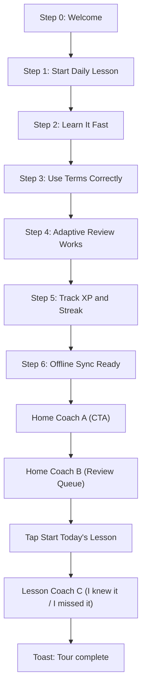

# Mediasis Tour Spec (Kenny Guide)

## Carousel Copy

1. Title: **Welcome to Mediasis**  
   Body: Build clinical vocabulary the way you actually study: fast, daily, and designed to stick.  
   Buttons: `Skip`, `Next`

2. Title: **Start Daily Lesson**  
   Body: Each day includes high-yield terms with personalized review in about six minutes.  
   Buttons: `Skip`, `Back`, `Next`

3. Title: **Learn It Fast**  
   Body: Reveal definitions and clinical examples, then complete a quick meaning check.  
   Buttons: `Skip`, `Back`, `Next`

4. Title: **Use Terms Correctly**  
   Body: Sentence completion with realistic distractors teaches proper clinical usage.  
   Buttons: `Skip`, `Back`, `Next`

5. Title: **Adaptive Review Works**  
   Body: Missed terms return sooner. Strong terms return later, right before forgetting.  
   Buttons: `Skip`, `Back`, `Next`

6. Title: **Track XP and Streak**  
   Body: Finish lessons consistently to build mastery before exams and clinical rounds.  
   Buttons: `Skip`, `Back`, `Next`

7. Title: **Offline Sync Ready**  
   Body: No internet? Progress saves locally and syncs automatically when online.  
   Buttons: `Skip`, `Back`, `Finish`

## Coach Marks

- Coach A (Home CTA):  
  “This is your daily queue. Tap here to begin.”
- Coach B (Review Queue):  
  “These are terms due for review - quick wins before exams.”
- Coach C (Lesson feedback):  
  “Be honest - this is how Mediasis adapts your review schedule.”
- Finish toast:  
  “Tour complete. Let's get you to today's lesson.”

## Flow Diagram

## Required Components

- `TourModal` (implemented via `app/tour.tsx` route card)
- `CoachMarkOverlay` (`src/ui/CoachMarkOverlay.tsx`)
- `ProgressDots` (`src/ui/ProgressDots.tsx`)
- `PrimaryButton` (shared `src/ui/Button.tsx`)
- `SpeechBubble` (`src/ui/SpeechBubble.tsx`)
- `Toast` (`src/ui/Toast.tsx`)

## Micro-animation Notes

- Splash: Kenny jump loop (240ms up/down).
- Carousel: card transition step-by-step with progress dots.
- Coach highlights: neon border emphasis around targets.
- Completion: toast auto-dismiss after 2.6s.
